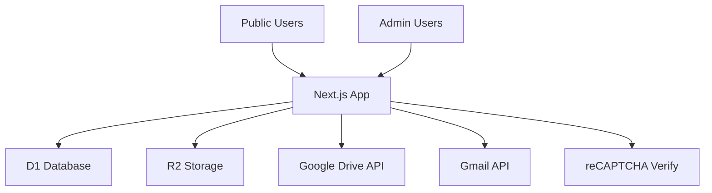

## Executive summary
Area36-website is a public-facing Next.js app with an admin area, backed by Cloudflare D1/R2 and Google APIs (Drive + Gmail). The highest-risk themes are (1) access control around “password‑protected” files and recordings, (2) abuse of public upload/survey endpoints and associated storage/email workflows, and (3) availability risks (both dependency DoS advisories and large/expensive public endpoints). Priority focus should be on server actions and API routes that gate file access and uploads.

## Scope and assumptions
- In-scope paths: `app/`, `lib/`, `components/`, `middleware.ts`, `next.config.ts`, `package.json`.
- Out of scope: CI/CD and infrastructure settings not defined in repo (e.g., Cloudflare dashboard headers/WAF/ratelimits).
- Confirmed context from user:
  - Deployment: Cloudflare/OpenNext.
  - Exposure: Mixed (public site + restricted/admin areas).
  - Data sensitivity: Mostly public documents with some minor password‑protected files.
- Assumptions:
  - Public pages and their server actions are accessible from the internet.
  - Admin area is restricted via NextAuth Google login with domain restrictions (`@area36.org`).
  - Edge security headers may be configured in Cloudflare but are not visible in repo.

Open questions that could change ranking:
- Are Cloudflare WAF/rate limits configured for public form submissions and file endpoints?
- Are there additional private documents outside the “minor password‑protected” set (e.g., PII in Drive)?

## System model
### Primary components
- Next.js app runtime (Cloudflare Workers via OpenNext) handling public pages and API routes. Evidence: `next.config.ts`, `package.json`, `app/api/**`.
- Authentication via NextAuth + Google provider with domain restriction. Evidence: `lib/auth/index.ts`.
- Database: Cloudflare D1 accessed via Drizzle. Evidence: `lib/db/index.ts`, `lib/db/schema.ts`.
- Object storage: Cloudflare R2 for images and flyers. Evidence: `lib/r2/index.ts`, `app/api/flyers/[...key]/route.ts`, `app/api/drive-images/[...key]/route.ts`.
- External APIs: Google Drive (file access), Gmail (email sending), reCAPTCHA. Evidence: `lib/gdrive/**`, `lib/gmail/**`, `app/contact/actions.ts`, `app/events/actions.ts`.

### Data flows and trust boundaries
- Internet user → Next.js app (public pages and Server Actions)  
  - Data: form fields, files, reCAPTCHA tokens.  
  - Channel: HTTPS (Cloudflare).  
  - Controls: Zod validation in several server actions; reCAPTCHA checks for public submissions. Evidence: `app/contact/actions.ts`, `app/events/actions.ts`, `app/grapevine/actions.ts`.
- Admin user → Next.js admin routes/actions  
  - Data: admin actions, file metadata, approvals.  
  - Controls: NextAuth `auth()` checks. Evidence: `app/admin/(dashboard)/**/actions.ts`, `app/api/admin/files/route.ts`, `lib/auth/index.ts`.
- Next.js app → D1 database  
  - Data: events, submissions, metadata, passwords.  
  - Channel: internal binding to D1.  
  - Controls: Drizzle ORM, server‑side only. Evidence: `lib/db/index.ts`, `lib/db/schema.ts`.
- Next.js app → R2 object storage  
  - Data: images, flyers.  
  - Channel: Cloudflare binding.  
  - Controls: type/size validation in server actions. Evidence: `lib/r2/index.ts`, `app/events/flyer-actions.ts`, `app/grapevine/actions.ts`.
- Next.js app → Google APIs (Drive/Gmail)  
  - Data: Drive file metadata/content; outbound emails.  
  - Channel: HTTPS with OAuth token.  
  - Controls: service account credentials in Cloudflare env. Evidence: `lib/gdrive/auth.ts`, `lib/gmail/client.ts`.
- Next.js app → Google reCAPTCHA verify  
  - Data: token + secret.  
  - Channel: HTTPS.  
  - Controls: token verification and score threshold. Evidence: `app/contact/actions.ts`, `app/events/actions.ts`, `app/grapevine/actions.ts`.

#### Diagram

## Assets and security objectives
| Asset | Why it matters | Security objective (C/I/A) |
| --- | --- | --- |
| Admin access/session | Controls approvals and content updates | C/I |
| Password‑protected files/recordings | Intended restricted access | C |
| D1 database (events, submissions, metadata) | Integrity of site content and submissions | I/A |
| R2 objects (flyers, images) | Availability + abuse cost | A/I |
| Google Drive files | Content and restricted documents | C/I |
| Gmail sender credentials | Email integrity and reputation | C/I |
| reCAPTCHA secret | Abuse prevention | C |

## Attacker model
### Capabilities
- Remote internet attacker can browse public pages, submit public forms, and call public API routes.
- Can upload allowed files where uploads are exposed to the public.
- Can attempt to forge client‑side cookies or craft arbitrary HTTP requests.

### Non-capabilities
- Cannot directly access Cloudflare environment secrets or D1 without an exposed route.
- Cannot access admin actions without a valid `@area36.org` Google login (unless an auth bypass exists).
- Cannot access private Google Drive content without server‑side token issuance.

## Entry points and attack surfaces
| Surface | How reached | Trust boundary | Notes | Evidence (repo path / symbol) |
| --- | --- | --- | --- | --- |
| Public form submissions | Browser → Server Actions | Internet → App | reCAPTCHA + zod validation | `app/contact/actions.ts#submitContactForm`, `app/events/actions.ts#submitEvent`, `app/grapevine/actions.ts#submitDriveConfirmation` |
| Flyer upload | Browser → Server Action | Internet → App | Uploads to R2 | `app/events/flyer-actions.ts#uploadEventFlyer`, `lib/r2/index.ts#uploadFlyer` |
| Public file listings | Browser → API | Internet → App | Lists Drive resources with caching | `app/api/gdrive/[type]/route.ts#GET` |
| File download/preview | Browser → API | Internet → App → Google Drive | Password gating via cookie | `app/api/files/download/[fileId]/route.ts`, `app/api/files/preview/[fileId]/route.ts`, `lib/files/access.ts` |
| Recording stream/download | Browser → API | Internet → App → Google Drive | Password gating via cookie | `app/api/recordings/stream/[fileId]/route.ts`, `app/api/recordings/download/[fileId]/route.ts`, `lib/recordings/access.ts` |
| Public flyers | Browser → API | Internet → App → R2 | Publicly served | `app/api/flyers/[...key]/route.ts` |
| Admin APIs | Browser → API/Actions | Admin → App | Requires NextAuth | `app/api/admin/files/route.ts`, `app/admin/(dashboard)/**/actions.ts` |
| Auth endpoints | Browser → API | Internet → App | OAuth + NextAuth handlers | `app/api/auth/[...nextauth]/route.ts`, `lib/auth/index.ts` |

## Top abuse paths
1. **Access protected files without passwords** → Forge `unlocked-*` cookie → call `/api/files/download/:id` or `/api/recordings/stream/:id` → receive restricted content.
2. **Abuse public flyer upload** → call `uploadEventFlyer` repeatedly with large files → R2 storage growth → cost/availability impact.
3. **Abuse submission endpoints for spam** → automate contact/event submissions (reCAPTCHA bypass or token reuse) → Gmail API sends spam → reputation harm.
4. **DoS via public endpoints** → repeatedly hit `/api/gdrive/*` or streaming endpoints → amplify load or third‑party API usage → availability impact.
5. **Exploit dependency DoS** → known Next.js vulnerabilities could be triggered → app instability or downtime.
6. **Metadata enumeration** → use public listing endpoints to infer sensitive file names/categories → privacy concerns (limited impact given mostly public docs).

## Threat model table
| Threat ID | Threat source | Prerequisites | Threat action | Impact | Impacted assets | Existing controls (evidence) | Gaps | Recommended mitigations | Detection ideas | Likelihood | Impact severity | Priority |
| --- | --- | --- | --- | --- | --- | --- | --- | --- | --- | --- | --- | --- |
| TM-001 | Internet attacker | Ability to set cookies on own client | Forge `unlocked-files` / `unlocked-recording-folders` cookie to access protected files | Unauthorized access to restricted docs/recordings | Protected files/recordings, Google Drive content | Cookie flags set (`HttpOnly`, `SameSite`, `Secure` in prod) | No integrity protection or server-side validation of unlock state | Move unlock state server‑side or sign/encrypt cookie; bind to user/session; short TTL | Log access to protected file endpoints with fileId + unlock state | Medium | Medium | High |
| TM-002 | Internet attacker | Public access to flyer upload | Repeatedly call flyer upload to store files in R2 | Storage cost/availability, abuse content | R2 bucket, operational costs | Type/size validation in upload | No auth/token gate; no rate limiting | Require upload token or reCAPTCHA on upload; rate limit; enforce eventId existence/ownership | Alert on high upload volume per IP/eventId | High | Medium | High |
| TM-003 | Internet attacker | Public access to submission endpoints | Automate contact/event/grapevine submissions | Email abuse, data pollution | Gmail sender, D1 data integrity | reCAPTCHA verification and zod validation | Reliance on reCAPTCHA only; no rate limiting mentioned | Add IP/user rate limits at edge; add per‑form throttling | Monitor submission rate anomalies | Medium | Medium | Medium |
| TM-004 | Internet attacker | Public access + expensive endpoints | Flood `/api/gdrive/*` or streaming endpoints | DoS or increased third‑party API cost | App availability, Google API quota | Caching for some endpoints (`withCache`) | No explicit rate limiting / quotas | Add edge rate limits; tighten caching; consider CDN caching for public assets | Monitor request rate and upstream API errors | Medium | Medium | Medium |
| TM-005 | Internet attacker | Exploit known Next.js vulnerabilities | Trigger known DoS issues in `next` | App downtime | App availability | None in code | Dependency version pinned to vulnerable range | Upgrade Next.js to patched version | Monitor crash/DoS signals | Medium | Medium | Medium |
| TM-006 | Opportunistic attacker | Public access to flyer endpoint | Use crafted filename metadata to influence response headers | Response splitting or cache issues | Public responses, caches | None | Original filename used in `Content-Disposition` | Sanitize filename or use server‑generated safe name | Log malformed filenames | Low | Low | Low |
| TM-007 | Insider or compromised admin | Valid `@area36.org` Google account | Modify admin data or access admin file listings | Integrity compromise of site content | Admin data, D1 | NextAuth domain restriction | No explicit admin role check beyond email domain | Add explicit admin allowlist/role check in `auth()` usage | Log admin actions with user id | Low | Medium | Low |

## Criticality calibration
- **Critical**: Pre‑auth full admin compromise, bulk exfiltration of private Drive docs, or compromise of Google service credentials.
- **High**: Auth bypass to protected files/recordings; large‑scale storage abuse; repeated DoS taking down public site.
- **Medium**: Targeted DoS or data pollution in D1; spam/abuse of email flows; dependency DoS issues.
- **Low**: Minor information disclosure (public file metadata), header quirks with low exploitability.

## Focus paths for security review
| Path | Why it matters | Related Threat IDs |
| --- | --- | --- |
| `lib/files/session.ts` | Unlock cookie integrity | TM-001 |
| `lib/recordings/session.ts` | Unlock cookie integrity | TM-001 |
| `app/api/files/download/[fileId]/route.ts` | Protected file access path | TM-001 |
| `app/api/recordings/stream/[fileId]/route.ts` | Protected recordings access | TM-001, TM-004 |
| `app/events/flyer-actions.ts` | Public upload surface | TM-002 |
| `lib/r2/index.ts` | Upload validation and metadata | TM-002, TM-006 |
| `app/contact/actions.ts` | Public email submission | TM-003 |
| `app/events/actions.ts` | Public event submission | TM-003 |
| `app/grapevine/actions.ts` | Public submission + image upload | TM-003 |
| `lib/auth/index.ts` | Admin auth policy | TM-007 |
| `app/api/gdrive/[type]/route.ts` | Public listing + caching behavior | TM-004 |
| `package.json` | Dependency versions | TM-005 |

## Quality check
- Entry points covered: public server actions, public API routes, admin routes, auth handlers, upload surfaces.
- Trust boundaries covered: Internet→App, App→D1, App→R2, App→Google APIs.
- Runtime vs CI/dev separation: CI/dev tooling excluded; runtime paths emphasized.
- User clarifications incorporated: Cloudflare deployment, mixed exposure, mostly public docs with minor protected files.
- Assumptions and open questions explicitly noted.

## Notes on use
- Evidence anchors are included via repo paths and symbols. Validate any edge‑configured controls (CSP, WAF, rate limits) directly in Cloudflare.
- If additional private documents or regulated data exist, re‑rate TM‑001 and TM‑003 to higher priority.
