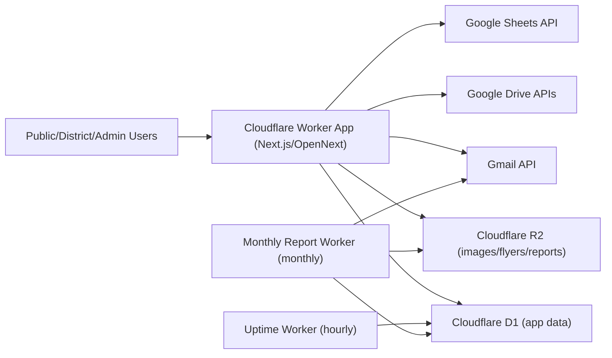

# Area 36 Website Architecture

Last updated: August 8, 2026

## 1. High-Level Overview
The Area 36 site is a custom Next.js application deployed to Cloudflare Workers (via OpenNext), with:
- Cloudflare D1 for relational data.
- Cloudflare R2 for selected binary assets (images/flyers/reports).
- Google Drive as the primary source for many document libraries.
- Google Sheets for lightweight temporary public form submission counts.
- Google-based admin authentication and email integration.

## 2. Runtime Components
| Component | Purpose | Config Anchor |
| --- | --- | --- |
| Next.js app on Cloudflare Worker (`area36-website`) | Public site, district site, admin UI, API routes | `wrangler.jsonc`, `next.config.ts` |
| Cloudflare D1 (`area36-website`) | Primary app database | `wrangler.jsonc`, `lib/db/schema.ts` |
| Cloudflare R2 (`area36-drive-confirmations`) | Drive confirmation images + event flyers/images | `wrangler.jsonc`, `lib/r2/index.ts` |
| Cloudflare R2 (`area36-reports`) | Monthly report artifacts (HTML/JSON) | `wrangler.jsonc`, `workers/monthly-report/wrangler.jsonc` |
| Uptime worker (`area36-uptime`) | Scheduled endpoint probes, writes `uptime_daily` | `workers/uptime/*` |
| Monthly report worker (`area36-monthly-report`) | Monthly operational report generation + email + R2 persistence | `workers/monthly-report/*` |

## 3. Domain and Request Routing Model
### Area site
- `area36.org` and `www.area36.org` resolve as Area context.

### District site model
- Hosts matching `d{N}.area36.org` (N=1..27, excluding 10) resolve as district context.
- Middleware checks district config in D1 and applies either `hosted` (rewrite to in-app district routes and district admin mapping) or `external_redirect` (308 redirect to configured external URL preserving path/query).

### Middleware responsibilities
- HTTPS redirect enforcement.
- Site-context resolution by host.
- Locale cookie initialization from `Accept-Language`.
- District host rewrites/redirects and admin auth routing.

## 4. Route Organization
| Route Group | Responsibility |
| --- | --- |
| `app/(public)` | Main public Area pages |
| `app/admin/(auth)` | Login flow |
| `app/admin/(dashboard)` | Area admin operations |
| `app/admin/districts/[district]` | Hosted district admin area |
| `app/district-site/[district]` | Hosted district public site |
| `app/api/*` | JSON/data/file/calendar/auth/report APIs |

## 5. Storage and Data Boundaries
### D1: source of structured operational data
D1 stores auth, events, district config/content, metadata overlays, reporting metrics, and role access data.

### Google Drive: source of many documents
Drive folders are used for newsletters, resources, recordings, committee docs, and service resources. App APIs fetch Drive files and enrich them with local metadata from D1.

### Google Sheets: lightweight form submission storage
Temporary public forms can append rows to designated Google Sheets using the Google service account. These forms use reCAPTCHA before appending and should remain limited to low-volume planning workflows.

The quorum workflow also uses one private Google Sheet per event. Drive `appProperties` hold event discovery metadata, while attendee rows and audited count corrections remain in the sheet. No quorum event or attendee table is stored in D1.

### R2: selected object storage
R2 is used for app-owned binary artifacts (submission images, flyers/images, monthly report output), not as the primary source for all document libraries.

## 6. D1 Table Inventory
### Auth/session tables
- `users`
- `accounts`
- `sessions`
- `verification_tokens`

### Events and recurrence
- `events`
- `event_to_types`
- `event_flyers`
- `event_exceptions`

### District sites and district content
- `district_sites`
- `district_admins`
- `district_contacts`
- `district_positions`
- `district_updates`

### Subscriptions/engagement
- `subscription_drives`
- `drive_submissions`

### File/recording controls
- `recording_folders`
- `file_metadata`

### Monitoring/reporting
- `uptime_daily`
- `errors_daily`
- `reports_monthly`

### Editable/i18n content
- `content_documents`

### App roles and corrections workflow
- `app_roles`
- `app_user_access`
- `corrections_contacts`
- `corrections_recipients`
- `corrections_matches`

## 7. Core Data Structures
### Event model
`events` is the base record with recurrence fields and status (`pending/approved/denied`).

Expanded structures:
- `event_to_types`: multi-type tagging.
- `event_flyers`: one-to-many attachments.
- `event_exceptions`: modified/cancelled occurrences for recurring events.

### District site model
`district_sites` controls subdomain behavior and monthly meeting settings, including:
- enable/disable status,
- hosted vs external redirect mode,
- meeting recurrence schema,
- location/online access details.

### Content model
`content_documents` stores per-scope/per-locale JSON with draft + published states. Public pages read published content (with controlled preview mode).

### File access model
`file_metadata` overlays Drive files with:
- webmaster-controlled display name,
- optional password lock,
- optional category/grouping.

### Recording access model
`recording_folders` registers folder IDs and passwords; only registered/unlocked folders are exposed through recording endpoints.

## 8. API Surface (Main Functional Categories)
| API Area | Examples | Purpose |
| --- | --- | --- |
| Events | `/api/events`, `/api/events/past`, `/api/calendar` | Approved event feeds + ICS export |
| District meetings | `/api/district-meetings` | Generated monthly district meeting occurrences |
| Drive-backed content | `/api/gdrive/[type]` | newsletters/resources/recordings/committees/service resources/materials |
| Protected file access | `/api/files/preview/[fileId]`, `/api/files/download/[fileId]` | Proxy access with metadata/password checks |
| Recording media | `/api/recordings/stream/[fileId]`, `/api/recordings/download/[fileId]` | Streaming/download with folder access checks |
| Site health | `/api/healthz` | Runtime + DB heartbeat |
| Reports | `/api/reports/[month]` | Monthly report artifact retrieval |
| Quorum | `/api/quorum/[eventKey]/summary`, `/api/quorum/[eventKey]/admin/attendees` | Public aggregate totals and protected live attendance administration |
| Auth | `/api/auth/[...nextauth]` | NextAuth handlers |

## 9. Admin Capabilities by Area
Area admin dashboard modules include:
- Events moderation and edits.
- Recordings folder/password management.
- Files metadata/password/category management.
- Subscription drive moderation and drive lifecycle.
- Monthly report viewing.
- Content Studio publishing.
- District site mode and district admin management.
- Corrections workflow administration.
- Quorum event creation, QR distribution, live attendance review, and audited duplicate/voting-seat corrections.

## Quorum operations

- `QUORUM_DRIVE_OWNER_EMAIL` selects the Area account that owns Quorum folders and spreadsheets; it defaults operationally to `webmaster@area36.org`.
- The owner connects once from Quorum admin through the existing Google login OAuth client using Google's recommended per-file `drive.file` scope. The existing Auth.js account record retains the offline grant.
- OAuth account grants are stored in each environment's existing Auth.js/D1 account record, so the owner must complete the Quorum Drive connection once in every deployed environment that creates events.
- The owner grant creates the private `Quorum` folder and new spreadsheets because service accounts do not receive personal Drive storage quota. The folder is shared with the existing service account, which uses a direct service-account Drive token to handle all unauthenticated form submissions, dashboard reads, and admin corrections server-to-server. Drive resource permissions restrict that identity to folders explicitly shared with it.
- `GDRIVE_QUORUM_FOLDER_ID` is an optional deployment override. When omitted, the app discovers its marked Quorum folder through Drive metadata.
- Public check-in lives at `/quorum/[eventKey]`; public aggregate totals live at `/quorum/[eventKey]/dashboard`.
- Personal attendee details are loaded only through a permission-gated, `no-store` API. They are never embedded in public HTML or the public summary payload.
- A closed event retains its aggregate public dashboard but removes the protected attendee panel. The private spreadsheet remains the detailed archive.
- `quorum:view` grants private attendee visibility; `quorum:edit` grants provisioning and correction operations.

District admin modules (hosted districts):
- Dashboard, Calendar, Contacts, Positions, Updates.
- Access is scoped to assigned district unless user is Area admin.

## 10. Auth and Authorization Model
Authentication:
- NextAuth + Google provider.
- Sign-in restricted to approved users (Area admins, district admins, seeded/assigned access).

Authorization:
- Area admin access checks for area-wide modules.
- District-scoped checks for district admin routes.
- Additional role/permission model (`app_roles`, `app_user_access`) for corrections and future granular controls.

## 11. Caching and Performance Notes
- Event API responses use edge caching (short TTL + revalidation headers).
- GDrive APIs use typed cache windows by content type.
- Content publishing path is intentionally no-store for immediate editorial updates.

## 12. Scheduled Jobs and Reporting
- Uptime worker runs hourly (`0 * * * *`) and writes per-endpoint health metrics.
- Monthly report worker runs monthly (`0 14 1 * *`) and compiles Cloudflare usage metrics, GitHub commit/deployment metrics, app-level metrics from D1/Drive, and report artifacts persisted to R2.

## 13. Architecture Diagram

## 14. Key Operational Couplings to Know
- District subdomain behavior depends on `district_sites` data in D1 (not static config).
- Many public document views depend on both Drive content and D1 metadata overlays.
- Content copy updates can bypass deploys (published from admin UI directly to D1).
- Release process and schema migrations must remain synchronized with admin feature changes.
